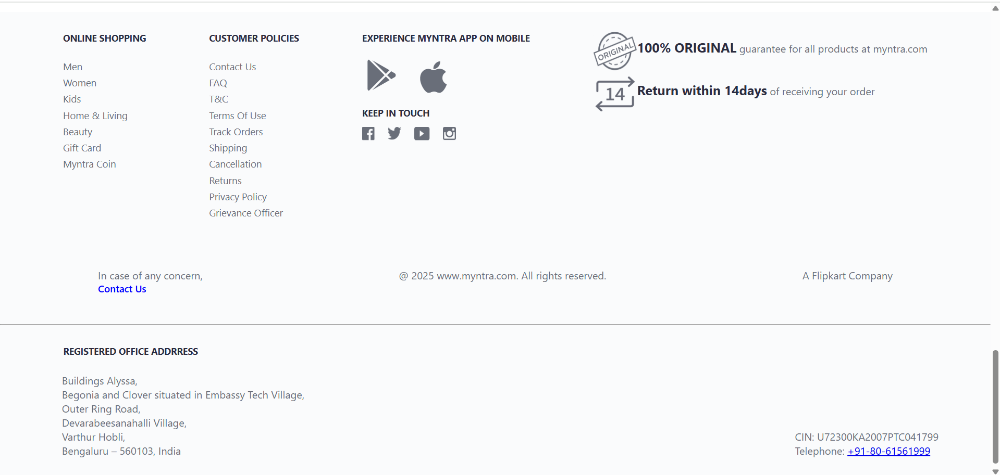

# Myntra-Clone

A responsive front-end clone of the Myntra website built using HTML and CSS.

---

This project is a front-end clone of the popular e-commerce website **Myntra**, developed using pure **HTML** and **CSS**. It replicates the design, layout, and styling of the original website, focusing on **UI consistency**, **hover effects**, and **mobile responsiveness**.

## Features

- Fully responsive layout for desktop and mobile screens
- Interactive hover effects on navigation and product items
- Organized homepage with hero banner, categories, and product grid
- Clean and modern user interface built using only HTML and CSS

## Tech Stack

- **HTML5** - for structure and content
- **CSS3** - for design, animations, and responsiveness

## Screenshots

*(A collection of screenshots highlighting key sections of the clone.)*

### Desktop View:

**Header and Hero**

**Product Grid**

**Footer Section**

---

## Live Demo

**Live Website:** [Click here to view the live site](https://smoon123-ai.github.io/myntra-clone/)

---

## Learning Outcome

Through this project, I learned:
- How to structure web pages using semantic HTML
- How to design layouts using CSS Flexbox and Grid
- How to add hover animations and smooth transitions
- How to make websites responsive using media queries

## Author

**Shamoon Hossain**

- Email: shamoonhossain007@email.com
- GitHub: [SMOON123-AI](https://github.com/SMOON123-AI)
